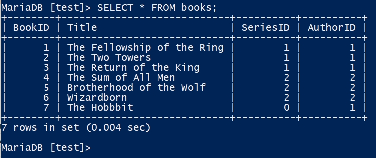

快速入门
===================
此章我们了解通过命令行登录数据库，进行简单的查询，创建，修改等操作，然后退出数据库。此章不会涉及高级内容，纯粹通过最简单的使用方式来熟悉数据库。

.. note:: 
    虽然通过windows平台安装的mariadb同步安装了一个图形化的客户端，但请暂时不要使用该客户端。

    .. image:: ../img/1-3.png
        :align: center

设置环境变量
---------------
开始之前，先设置一下系统的环境变量，以便于之后的命令行使用。

按住WIN+R，然后在弹出的窗口中键入 ``SystemPropertiesAdvanced``,打开windows的高级设置。

然后点击 **高级** -> **环境变量**,点击系统 **系统变量** 中的 **Path**，然后点编辑，如下：

点击新建，将mariadb的安装路径添加到这里，如下：

.. note:: 
    如果不确定Mariadb的安装路径，可以参考 :ref:`install_after_label`，右键服务中的MariaDB，选择属性，即可看到MariaDB的安装路径，如下：

    .. image:: ../img/2-5.png
        :align: center

    如上图的安装路径就是d:\\Program Files\\MariaDB 11.5\\bin，应该在系统变量中新增此条目。

如一切设置妥当，按住WIN+R，键入 ``powershell``，然后输入 ``mysql -V``，即可看到如下信息：

数据库基础操作
-------------------

登录数据库
^^^^^^^^^^^^^^^^
在刚刚打开的powershell中，输入以下命令，就可以登录之前安装好的数据库：

.. code-block:: sql

    mysql -u root -p -h 127.0.0.1

按下回车键后会提示输入安装数据库时设置的root密码，如果一切顺利，你将看到如下界面，表示你已经登录成功：

.. hint:: 
    mysql是MariaDB的命令，此命令是访问数据库最基础的方式，在数据库的专用服务器上并没有安装其它软件，此种情况下，mysql是访问数据库的唯一方式。

    参数解释：
     * -u 表示用户user，root用户是数据安装时默认的管理员用户。
     * -p 表示密码password，不建议在命令行直接输入密码，有暴露密码的风险，而且是回车后输入密码。
     * -h 表示主机host，是数据库服务器的ip地址，由于我们是在本地安装运行数据库，所以使用127.0.0.1本地回环地址即可。

.. _operate_db:

数据库操作
^^^^^^^^^^^^^^^^^^
登录数据库后，我们需要SQL语句进行操作，SQL语句即 *Structured Query Language*，一个SQL语句去数据库查询数据称之为一次查询，现代关系型数据库都需要SQL语言进行管理操作。除了在某些数据库上有细微差别外，SQL在所有关系型数据库上的操作几乎一致。

数据库将数据存储于表table中，它很像excel中的sheet，但管理使用数据更精细，一个excel文件就像一个数据库，这个数据库中包含了多个表格sheet，当前可以这样理解数据库的数据存储方式。

接下来我们创建一个新的数据库并创建表格插入数据，可以理解为新建一个excel文件，请复制以下代码在刚刚的登录成功的数据库上执行：

.. code-block:: sql

    CREATE DATABASE IF NOT EXISTS test;

    USE test;

    CREATE TABLE IF NOT EXISTS books (
        BookID INT NOT NULL PRIMARY KEY AUTO_INCREMENT, 
        Title VARCHAR(100) NOT NULL, 
        SeriesID INT, AuthorID INT);
    
    CREATE TABLE IF NOT EXISTS authors
    (id INT NOT NULL PRIMARY KEY AUTO_INCREMENT);

    CREATE TABLE IF NOT EXISTS series
    (id INT NOT NULL PRIMARY KEY AUTO_INCREMENT);

    INSERT INTO books (Title,SeriesID,AuthorID)
    VALUES('The Fellowship of the Ring',1,1), 
      ('The Two Towers',1,1), ('The Return of the King',1,1),  
      ('The Sum of All Men',2,2), ('Brotherhood of the Wolf',2,2), 
      ('Wizardborn',2,2), ('The Hobbbit',0,1);

.. hint:: 
    当前无需理解刚刚的SQL语句，随着教程的深入，这些内容以后会逐渐理解。注意[]中的test，表示当前在数据库test中，一个数据库服务中有多个数据库，使用USE指定要操作的数据库，比如上面的 ``USE test;``。

    可以使用 ``SHOW DATABASES;`` 查看当前数据库服务上有哪些数据库，注意红框中的数据库是系统默认的数据库，目前无需了解它们的作用，也不要对它们进行操作：
    
    .. image:: ../img/2-14.png
        :align: center

看一下刚刚创建好的表格，接键入 ``SHOW TABLES;``：

如果一切顺利，你将得到如上图的结果，这是我们刚刚创建好的表格。来看一下其中一张表的信息，键入 ``DESCRIBE books;``：

请观察 **field** 那一列，这些名字就是一个表中存储的数据字段名，数据库中的每一个表格都规定了表格数据的写入要求，其它列暂时不关注，我们只关注 **field**。

.. hint:: 
    请注意一下 **BookID** 一行末尾的 **auto_increment**，这个字段表示该字段是自动增长的，你可以理解为每条数据都
    有序号，按先后顺序排序。在每条数据插入时，该字段都会自动加一，并随数据一同写入，下面的例子中你将会见到这个场景。

现在去这个表中获取一些数据来看看，此时我们需要使用 **SELECT** 语句，请键入以下命令：

.. code-block:: sql

    SELECT * FROM books;

可以看到第一行就是刚刚 **Files** 那一列的数据，SELECT中的 **\*** 号表示选择所有列的数据。

.. _insert_data:

在表中插入数据
^^^^^^^^^^^^^^^^^^^^^^^^
如果想在表中插入一些数据，需要使用 **INSERT** 语句：

.. code-block:: sql

    INSERT INTO books (Title, SeriesID, AuthorID)
    VALUES ("Lair of Bones", 2, 2);

第一个括号中表示要插入数据的列，第二个括号表示要给这些列插入的数据，两者的顺序要一致。 ``Query OK, 1 row affected (0.006 sec)`` 则表示 **INSERT** 执行成功且写入一条数据。

.. hint:: 
    正如你所见，INSERT语句中并没有BookID这个字段，但在你使用 ``SELECT * FROM books;`` 查数数据后
    发现，刚刚插入的 **Lair of Bones** 这一行数据中的 **BookID** 字段自动写入并且“序号”为8。

再次执行 ``SELECT * FROM books;`` 查看books表中的数据，观察刚刚插入的那条数据。 注意第7行的书名 **The Hobbbit** ，应该拼写为 **The Hobbit** 。

此时需要修改数据。

.. _modify_data:

在表中修改数据
^^^^^^^^^^^^^^^^^^^^^^^^
要修改数据，需要使用 **UPDATE** 语句，执行以下命令修改表中的第7条数据。

.. code-block:: sql

    UPDATE books 
    SET Title = "The Hobbit" 
    WHERE BookID = 7;

.. hint:: 
    SET 表示要更新的字段，同时用等于号赋值，而WHERE则指定要修改哪一条数据，BookID在整个表中是唯一的，因此这个SQL语句准确的修改了我们需要更新的数据。
    
    此时再使用上面的SELECT语句进行查询，看看UPDATE语句是否修改正确。

.. _select_where:

删除表中的数据
^^^^^^^^^^^^^^^^^^^^^^^^^
如果想要删除表中的数据，需要使用 **DELETE** 语句，在此之前先确定一下要删除的数据。运行 ``SELECT * FROM books``，查看当前的数据。

注意观察上方图片中的绿色框和红色方框的内容，绿色是不重复且唯一的，但红色却有重复的。

上个小节，我们 :ref:`modify_data` 时更新了一条数据，使用 **WHERE** 指定了要修改的数据。所以，你也可以联想到使用 **DELETE** 语句时也要指定条件，不过 **SELECT** 语句也可以指定条件，它可以帮助我们在删除数据之前确认一下要删除的数据是否是我们期望的。

比如我们期望删除所有 **AuthorID** 为2的数据，首先来确认一下这些数据是什么，执行如下命令：

.. code-block:: sql

    SELECT * FROM books WHERE AuthorID = 2;

假使以上数据就是我们删除的，经过 **SELECT** 语句的确认，我们要将其删除，此时就要 **DELETE** 语句来达到我们的目的了，但它的语法却与 **SELECT** 及其相似，请执行如下命令：

.. code-block:: sql

    DELETE FROM books WHERE AuthorID = 2;

**DELETE** 语句执行完后，请执行 ``SELECT * FROM books;`` 确认我们期望的数据是否删除。

至此，对于数据库的基本操作你就有了基础了解，现在在数据库中执行 ``EXIT`` 即可退出数据库。

正如你所见，使用数据库并不难，只需要理解SQL语句，不要输入错误的指令，不要搞混字段及字段值的顺序即可。
