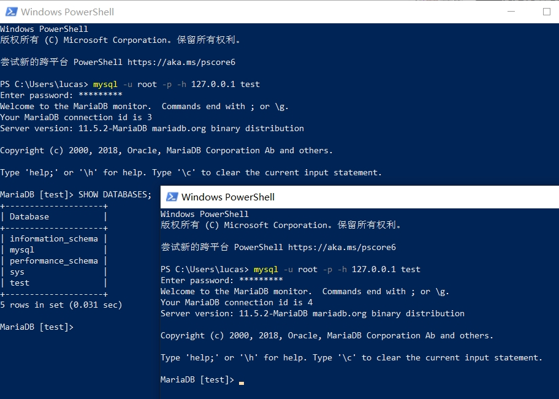
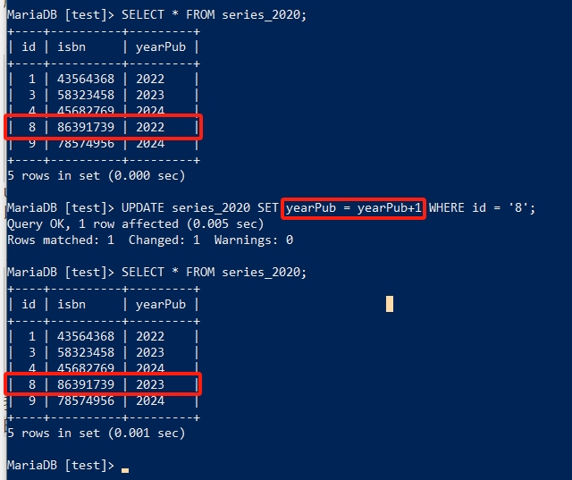
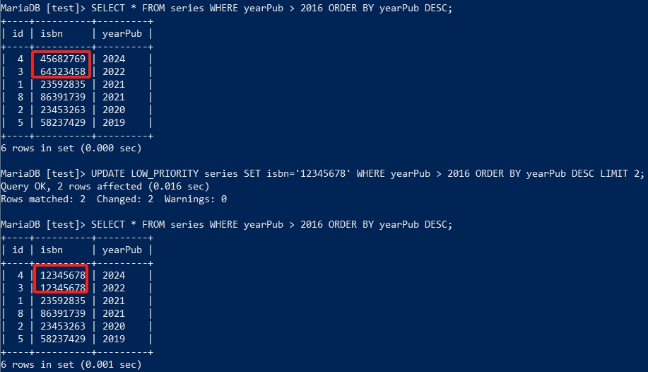
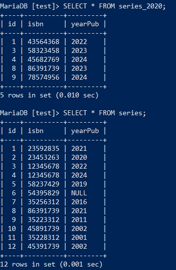
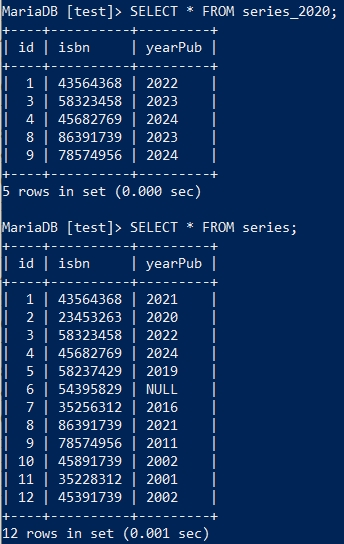
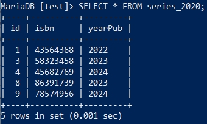
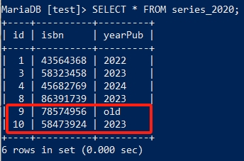

数据的插入与修改
===================
在 :doc:`/newcomer/1_beginner` 中我们已经进行过一些简单的数据插入与修改，它们也像上一节 :doc:`/newcomer/2_select` 的 **SELECT**
一样，有更多复杂的使用方式来应对真实应用场景中的各种需求，这一节就来探索一下在MariaDB中如何进行数据的添加与修改。

.. important:: 
    请确保你已学习过 :doc:`/newcomer/1_beginner` 和 :doc:`/newcomer/2_select` ，本节内容将使用在这两节教程中创建及修改的表结构及数据。

插入数据
-------------------
接着使用在 :doc:`/newcomer/1_beginner` 中创建的series表，在增加数据前可以使用 ``SELECT * FROM series;`` 以及 ``DESC series;`` 来看一下它现在的状态。

.. image:: ../img/4-1.png
    :align: center

然后执行如下的SQL来添加数据，注意4要与上方图中的 **id** 顺序接上，45682769、2024则与 **isbn** 与 **yearPub** 对应：

.. code-block:: sql

    INSERT series
    VALUES
    ('4','45682769','2024');

再次执行 **SELECT** 查询语句查看刚刚查入的数据。

以上是 **INSERT** 非常基础的用法，它不需要指定字段名，直接把要插入的字段值带上即可写入到表中。
如果不想插入全部字段的值，只想插入某一个或几个的字段值，可以直接指定要写入的字段值：

.. code-block:: sql

    INSERT INTO 
    series
    (isbn,yearPub)
    VALUES
    ('58237429','2019');

.. hint:: 
    如 :ref:`insert_data` 中举的例子，series的id字段是 **auto_increment** 属性的，因此插入数据时没有提供id这个字段的值。

    同时在这条SQL中出现了 **INTO** 关键字，它是可选项，有无都不影响INSERT的执行。

只给一个字段插入数据：

.. code-block:: sql

    INSERT
    series
    (isbn)
    VALUES
    ('54395829');

而未在INSERT中指定的字段则默认为 **NULL** ：

.. image:: ../img/4-2.png
    :align: center

而要想同时插入多条数据，可使用如下句式：

.. code-block:: sql

    INSERT IGNORE
    INTO 
    series
    VALUES 
    ('7','35256312','2016'),
    ('8','86391739','2021'),
    ('8','48932895','2022');

.. hint:: 
    注意到这条SQL的执行结果了吗？

    .. image:: ../img/4-3.png
        :align: center

    明明我们插入了3条数据，但是只有“2 rows affected”，通过SELECT查询发现只写入了两条数据。

虽然插入多条数据，但是第一个字段的8重复了，这个字段对应的是“id”，它是 **auto_increment** 属性的，虽然字段是自动增长的，但它不允许重复。
正常执行重复数据的插入是会报错的，但上面的SQL使用了 **IGNORE** 这个关键字，它会自动忽略重复的值，所以第一条和第二条数据插入了，但第三条数据并没有并插入。

如果我们再次插入重复的数据，而不加上 **IGNORE** 看看会发生什么：

.. code-block:: sql

    INSERT
    INTO 
    series
    VALUES 
    ('9','35223312','2011'),
    ('10','45891739','2002'),
    ('10','48932845','2024');

加上 **IGNORE** 上面的SQL也可以正常执行。

插入优先级
-----------------
像 :ref:`SELECT_priority` 一样，INSERT也可以调整执行的优先级。\
在一个繁忙的服务器上，INSERT语句是高于SELECT语句优先执行的，当INSERT语句执行时，\
会将写入的表锁住，此时SELECT语句需要等待INSERT语句执行结束后执行，这会引起用户不\
好的体验，如果不想让用户等待而插入的数据又可以晚一会儿插入，那可以降低INSERT语句\
的执行优先级:

.. code-block:: sql

    INSERT LOW_PRIORITY
    INTO series
    VALUES
    ('11','35228312','2001'),
    ('12','45391739','2002');

**LOW_PRIORITY** 会把所有带有 ``LOW_PRIORITY`` 的flag语句放入到一个队列当中，这个队列只有在其它\
等待的请求完成后才会执行，即使有新的请求进来，也会插入到这个队列之前执行。只有\
所有等待执行的请求执行完成后， **LOW_PRIORITY** 的语句才会执行。

.. note:: 

    数据库中还有一个事务（transaction）的概念，LOW_PRIORITY的语句又会有不同的表现，这个\
    在后续的内容中会再次提及。

举个例子：现在MariaDB服务中有100条SELECT语句正在排队执行，现在输入了3条带有LOW_PRIORITY的INSERT\
语句，这3条SQL语句按先后顺序组成了一个队列，等待前面100条SELECT执行完成后执行。然而，\
在SELECT执行到第95条时，又输入了20条SELECT的语句，这时这20条SELECT还是会排在3条INSERT\
的列队前执行。终于，所有等待执行的SELECT执行完了，这时INSERT的列队中的语句才会按顺序开始执行。

不过LOW_PRIORITY还有一个潜在的风险，如果使用LOW_PRIORITY的INSERT语句，在一个非常\
繁忙的MariaDB服务器中插入数据，会导致这条SQL一直在等待执行导致客户端无法进行其它操\
作，等待时候长到数分钟及至数小时以上。想进行其它操作，只能新开一个客户端了：

.. hint:: 
    mysql是MariaDB的客户端，它可以用同一个用户多次连接同一个数据库，但每一个连接都\
    是独立且互不影响的。

查询插入
------------------
在一个数据库服务中，某些表的结构较为相似甚至一样。举个例子：在 **series** 表中记录\
了id，isbn，yearPub三个字段信息，现在需要创建一个新表格记录2020年之后的isbn信息，\
但字段也是id，isbn，yearPub这三个，将 **series** 表中大于2020年的信息存在在这个表\
中，怎么办？

这时候就可以将INSERT和INSERT语句直接组合起来，就可以达到此目的：

.. code-block:: sql

    CREATE TABLE 
    series_2020 
    LIKE series;

    INSERT INTO 
    series_2020 
    (id,isbn,yearPub) 
    SELECT id,isbn,yearPub 
    FROM series 
    WHERE yearPub > 2020;

第一条SQL创建新表series_2020，但表结构和series保持一致，第二条SQL的作用是INSERT\
为新表series_2020插入数据，但使用SELECT查询出来的数据进行插入。在执行完以上SQL后\
可以使用SELECT语句查询一下series_2020表中有什么内容。

这个方法在类似场景\
中非常有用，不过需要注意的是INSERT...SELECT不能作用于同一张表，如以下错误的用法:

.. code-block:: sql

    INSERT INTO 
    series_2020 
    (id,isbn,yearPub) 
    SELECT id,isbn,yearPub 
    FROM series_2020 
    WHERE yearPub > 2020;

数据替换
--------------
再假设一种情况，我们在series中插入了大量数据，但是插入的数据有误，我们想在保留顺序字段\
id的情况下，更正成正确的数据，该怎么办？

这时就可以使用REPLACE语句了：

.. code-block:: sql

    REPLACE LOW_PRIORITY 
    INTO series_2020 
    (id,isbn,yearPub) 
    VALUES 
    (1,43564368,2022),(3,58323458,2023);

对比之前的series_2020中的内容，REPLACE语句保持id字段内容不变，替换了isbn和yearPub\
的内容，LOW_PRIORITY同样也会在REPLACE中生效。REPLACE的语法和INSERT一样，当然也可以像INSERT...SELECT使用SELECT进行组合\
使用，REPLACE在进行替换时是先将原有行（row）删除，然后再将替换的内容插入。

数据更新
---------------
REPLACE适用于批量更新数据，但是如果我只想更新一个值，该怎么办？这时候就可以使用UPDATE\
了：

.. code-block:: sql

    UPDATE LOW_PRIORITY 
    series_2020 
    SET yearPub = '2022' 
    WHERE id = '8';

UPDATE的语法与REPLACE及INSERT的语法稍有不同，不过LOW_PRIORITY仍然起作用，甚至IGNORE\
也是起作用的。UPDATE使用SET从句来指定要更新哪里的值，同时使用WHERE从句指定更新的条件。\
顺便提一下，SET从句也可作用于REPLACE和INSERT语句中，但只能作用于一行(row)数据。

.. code-block:: sql

    INSERT INTO 
    series_2020 
    SET 
    id='9',isbn='78574956',yearPub='2024';

UPDATE语句有一个非常有用的特性是可以使用某个字段(column)的值为基础来更新本字段的值，如\
以下的示例：

.. code-block:: sql

    UPDATE series_2020 
    SET 
    yearPub = yearPub+1 
    WHERE id = '8';

我们要更新id为8那一行数据中的yearPub的值，在原有值的基础上加1，然后在数据库中录入新\
的值。

.. note:: 

    MariaDB数据库中内置数值函数（Numeric Functions），可以直接进行加减乘除的运算，如：

    .. code-block:: sql

        SELECT 2 + 2;
        SELECT 2 - 1;
        SELECT 2 * 2;
        SELECT 2 / 2;

UPDATE甚至可以使用ORDER从句按某个排序规则更新数据：

.. code-block:: sql

    UPDATE LOW_PRIORITY series 
    SET isbn='12345678' 
    WHERE yearPub > 2016 
    ORDER BY yearPub DESC 
    LIMIT 2;

这里的WHERE、ORDER和LIMIT的使用方法和SELECT语句一致：WHERE指定了大于2016的条件，\
ORDER指定了以yearPub的字段值倒序进行排序，LIMIT指定只作用于2行的范围。

UPDATE还可以像SELECT多表联合查询那样，进行多表关联数据“对齐”：

.. code-block:: sql

    UPDATE series,series_2020 
    SET series.isbn = series_2020.isbn 
    WHERE series.id = series_2020.id;

在此SQL执行前，两个表的数据状态：

执行完之后的数据状态：

此条UPDATE语句并不是来“更新”数据的，而是让两个表格互相访问彼此的数据，通过id关联\
两张表，对齐isbn字段的数据。在这种UPDATE关联两张表的操作中，从句ORDER BY和LIMIT\
不能使用，否则会引发SQL执行错误。

此前的INNER语句还可以与UPDATE组合，产生独特的作用：

.. code-block:: sql

    INSERT IGNORE 
    INTO series_2020 
    (id,isbn,yearPub) 
    VALUES 
    (9,43823744,2025),(10,58473924,2023) 
    ON DUPLICATE KEY 
    UPDATE yearPub = 'old';

此SQL执行前表中的数据：

执行完SQL之后的状态：

试想一下，当需要在表中插入大量数据时，有些数据可能是重复的，但如果我想知道对重复的数据\
做一个标记呢？这时INSERT加UPDATE组合的SQL就派上用处了。

IGNORE本身就是阻止重复数据的录入，加入这个参数后，SQL中的重复数据不会被插入且SQL不会\
报错；这里加入了一个“ON DUPLICATE KEY”的从句，UPDATE指定了这个KEY的关键字段为yearPub，\
虽然重复数据被IGNORE挡住了没有录入表中，但触发了“ON DUPLICATE KEY”的条件，然后UPDATE\
会向yearPub的字段中当入指定值“old”，之后我们就可以通过查询old来确定表中因重复数据而未\
录入的数据有哪些。

