修改表结构
========================
我们在快速入门中的 :ref:`operate_db` 创建了test数据库及books、authors和\
series三张表，之后的SELECT、INSERT、UPDATE等内容都会按照当初创建它们时的\
表结构进行操作。这些定义都是可以被修改的，现实中的生产活动中，也因为规划不足、\
业务变化等各种原因需要对当初的表结构进行修改，这章我们就来探讨一下相关问题。

.. hint:: 

    请确保你已学习之前的章节，本章内容依旧会采用之前章节产生的数据进行练习。

准备工作
------------------
在之前的章节中，我们创建了三个表，而且它们的表结构非常简单：

.. code-block:: sql

    SHOW TABLES;
    DESCRIBE authors;
    DESC books;
    DESC series;

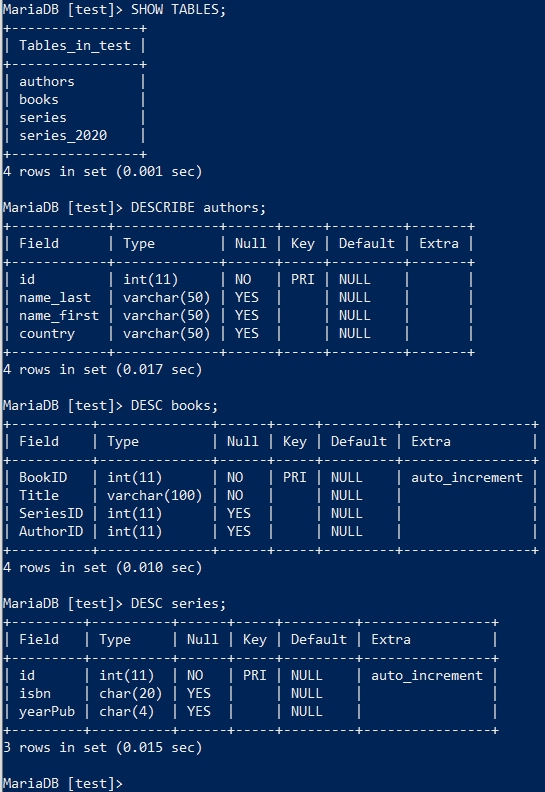

这些表记录的信息非常有限，因此我们需要拓展字段（column）或者改变字段的属性。这些\
表中已经包含数据，在对表结构进行更改前，通常需要对其进行备份，以防不测。

.. warning:: 

    数据库中的数据非常重要，现实生产环境中的数据库数据可能已经包含商业往来数据，如\
    操作不慎导致数据异常或丢失，会造成极其严重的后果。如你在网上下单买了一千元的\
    商品，此时服务商的数据库出现问题，他们的数据库显示你并没有购物，但已经扣了你一千\
    元！
    
    所以在对数据库操作之前，进行备份是非常重要的。虽然我们的学习环境并无重要信息，\
    但养成备份的习惯还是很重要的。

MariaDB在安装时就自带了一个备份工具，它可以很方便的对数据库进行备份：

.. code-block:: shell

    # --password='******' *号替换成自己的数据库密码后执行
    # mysqldump和mysql一样，是MariaDB的命令行命令之一，需在SHELL中执行
    mysqldump --user='root' --password='******' --add-locks test authors > authors.sql

mysqldump命令与mysql很相似，--user就是用户名，--password就是密码，--add-locks即在\
备份前锁表，一般是写锁表，只可以读取（如SELECT），不可以写入（如INSERT）;备份完成后自\
动解除锁表。test即表明要操作的数据库名为test，authors即是要备份的表， **>** 表示将\
备份内容重写向到文件authors.sql中。

执行完成后，你可以找到authors.sql这个文件，这就是备份文件：

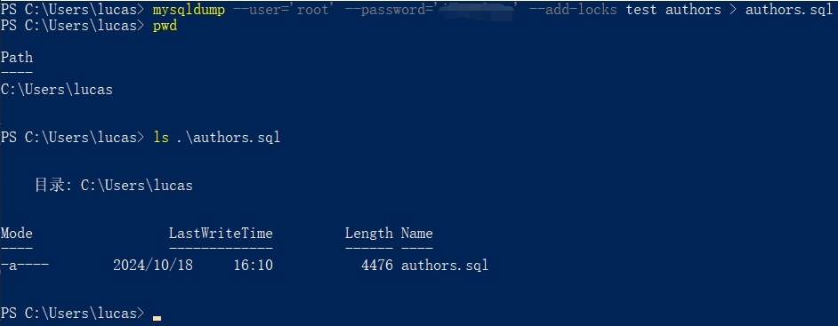

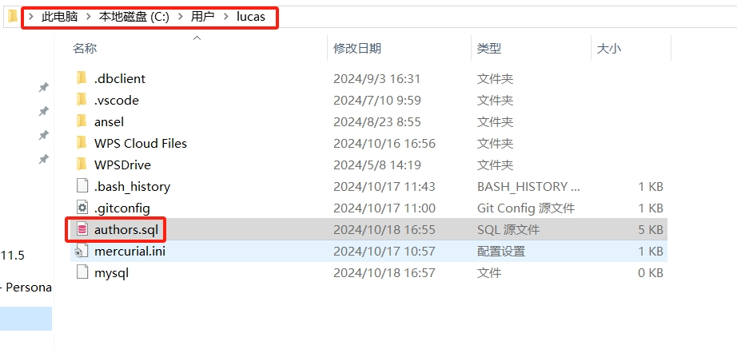

.. note:: 

    ``pwd`` 是“Print Working Directory”，打印当前文件侠所在位置的命令。
    
    ``ls`` 是“list directory contents”，列出文件夹内所有内容的命令。

这个文件甚至可以用记事本打开查看，里面就是SQL命令：

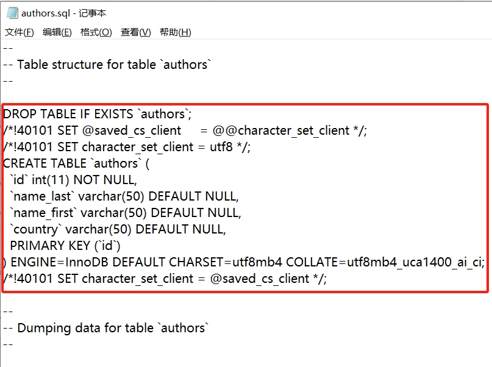

备份完成后，可以使用这个文件恢复备份内容：

.. code-block:: powershell

    # Windwos系统使用此命令，需要在按下回车键后输入密码，也可像mysqldump在-p后加上密码
    Get-Content .\authors.sql | mysql -u root -p -h 127.0.0.1 test
    # Linux系统使用此命令，需要在按下回车键后输入密码，也可像mysqldump在-p后加上密码
    mysql -u root -p -h 127.0.0.1 test < authors.sql

恢复备份文件使用的是mysql而非mysqldump，备份文件直接输入重定向至mysql，数据库在读取\
到备份文件后，会先删除原有的authors表，然后再恢复备份好的authors表，所以在恢复动作\
执行期间确保没有用户在写入数据。

在掌握备份和恢复方法后，接下来可以进行表结构进行操作了。

添加字段
-----------------
在快速入门中的 :ref:`operate_db` 创建表是使用了 ``CREATE TABLE`` 来创建这些表，\
而要在现存的表中添加字段，则需要使用 ``ALTER TABLE`` 来进行(注意先将authors表备份)：

.. code-block:: sql

    ALTER TABLE authors
    ADD COLUMN gender CHAR(1);

以上SQL在authors表中新增了一个字段（column）gender来表示作者性别，我们用M（male）\
来代理男性，F（female）来表示女性，该字段只使用1个字符。可以用 ``DESCRIBE authors`` 来查看新增的字段：

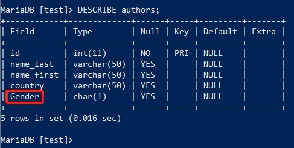

请注意 **Type** 那一列，目前这个表中有int、varchar、char三种类型，在 :doc:`1_beginner` \
中并没有对这些数据类型做过介绍，在熟悉数据库许多操作后，此时应该对\
数据库中的数据类型（data type）做一些了解了。

数据库存储数据是有很多类型的，这些类型的数据对存储空间、读写速率、存储引擎支持等等有\
诸多影响，所以数据库在设计规划阶段就要考虑很多因素和影响。数据类型大抵分为数字型(Numeric Data Types)、\
字符型(String Data Types)、时间型(Date and Time Data Types)和其它类型(Other Data Types)，这些数据类型总计达几十种以上之多，具体可 `点击这里`_ 查看。

.. _点击这里: https://mariadb.com/kb/en/data-types/

这么多种数据类型目前并不需要我们一一掌握，只要记住int、char、varchar等等常见类型，在\
进一步熟悉数据库后，可根据场景需求再进一步选择合适的数据类型即可。

目前遇到的数据类型如下：

#. `int`_ ：integer，整数型，范围为0-4294967295或-2147483648-2147483647。
#. `char`_ ：指定长度的字符类型，当存储的数据未达到指定长度时，在数据右侧填充空格，长度为0-255。
#. `varchar`_ ：可变长度的字符类型，存储时按数据大小存储数据，更节省空间，长度为0-65532。

.. _int: https://mariadb.com/kb/en/int/
.. _char: https://mariadb.com/kb/en/char/
.. _varchar: https://mariadb.com/kb/en/varchar/

在了解完数据类型后，再接着往下看。

我们为authors表添加了一个gender字段，现在还想加一个Address的字段，并且想在gender之\
前，这个该怎么办？

只需要在原有的ALTER TABLE中加一个ALTER从句指定位置即可：

.. code-block:: sql

    ALTER TABLE authors
    ADD COLUMN address varchar(25)
    AFTER country;

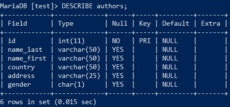

如果想让address字段处于第一位置，可以使用FIRST：

.. code-block:: sql

    ALTER TABLE authors
    ADD COLUMN address varchar(25)
    FIRST;

字段枚举
-------------
之前虽然加上gender这个字段，我们设想的是输入M或F，但是因为没有限制，用户其实可以随便\
输入的，但是能不能进行选择输入呢？这就是枚举，只能选择指定的值进行输入：

.. code-block:: sql

    ALTER TABLE authors 
    MODIFY gender ENUM('M','F');

使用MODIFY从句，修改了gender字段的属性，之前是 ``CHAR(1)`` ，修改为了 ``ENUM('M','F')`` ，\
而 `ENUM`_ 正是属于 **字符型（String Data Types）** 之一的数据类型。此时如果想要\
录入指定数值之外的值，就会报错，只能录入指定的M或F。

.. _ENUM: https://mariadb.com/kb/en/enum/

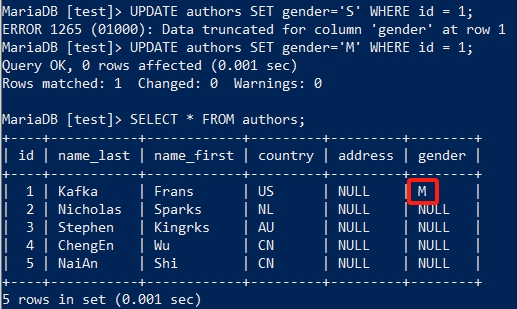

如果想改变字段名，可以使用 ``CHANGE`` 从句，同时还可以改变多个字段定义，每个字段修改用逗号\
隔开：

.. code-block:: sql

     ALTER TABLE authors 
     CHANGE gender sex ENUM('M','F','male','female'),
     CHANGE address address1 varchar(50);

如上，我们修改了性别的字段名，多加了两个枚举值；同时修改了地址字段名，增加字段长度到50。\
但目前我们做所的修改都是建立在表中没有对应字段数据的情况下，枚举字段在已存在数据的情况下，\
修改枚举字段定义与现有数据相符的情况下，会导致报错无法修改：

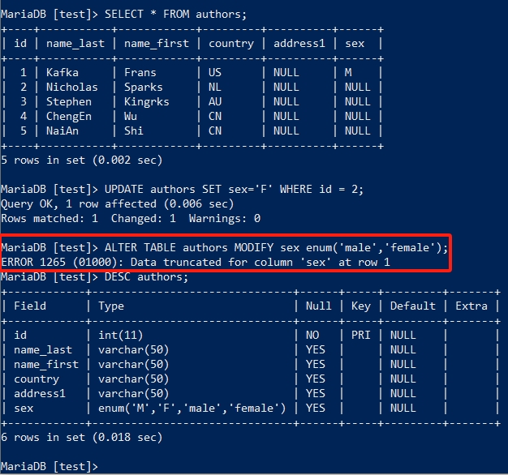

所以想要顺利修改字段定义，需要先修改数据，然后再更改字段定义：

.. code-block:: sql

    UPDATE authors SET sex='male' WHERE sex='M';
    UPDATE authors SET sex='female' WHERE sex='F';
    ALTER TABLE authors MODIFY sex enum('male','female');

将已存在的数据修改成与要修改的枚举定义相符的数据后，修改表结构方可正常进行。

假使我们决定不在使用sex这个字段了，要将其删除，可以使用 ``DROP`` 进行删除：

.. code-block:: sql

    ALTER TABLE authors DROP sex;

但sex字段我们已经更新了数据，删除这个字段会发生什么？DROP从句会将这个字段及其数据\
都删除，其它未涉及的字段及数据并不会做改动，但DROP从名执行时并不会有提示，且删除\
过程不可逆，删除的数据无法恢复。因此执行对表结构的更改时要非常慎重，同时在执行之前做好备份，\
以防止误操作而使数据无法追加：

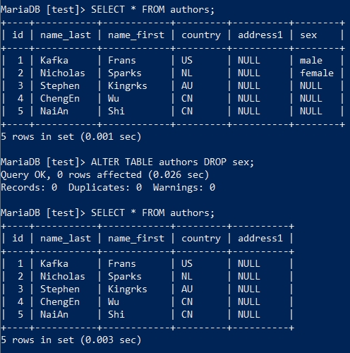

设置默认值
------------------
在使用 ``DESCRIBE`` 查看表结构时，我们会看到有一列为Default的内容：

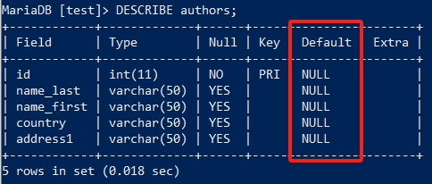

每个字段都可以有一个默认值，在创建表时如果没有为字段指定默认值，那么默认值就是NULL。\
这个默认值在数据录入时，没有指定为该字段录入，它也可以自动录入默认值：

.. code-block:: sql

    ALTER TABLE authors 
    ALTER country SET DEFAULT 'CN';

    INSERT INTO authors 
    (id,name_last, name_first, address1) 
    VALUES 
    (6,'San', 'Zhang', 'Beijing');

以上SQL为country字段指定了默认值CN，同时新插入一条数据，但没有为country这个字段插入数值，\
但刚刚修改好的字段会自动插入默认值;如果插入数据为country字段指定了数值，那将以指定\
数据为准，不会录入CN这个默认值。

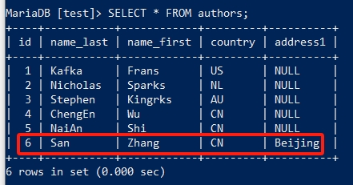

我们认为country设置的这个默认值不太合适，准备去掉默认值，它也是可以“DROP”掉的，这个DROP不会\
删除数据：

.. code-block:: sql

    ALTER TABLE authors 
    ALTER country DROP DEFAULT;

索引相关字段的修改
---------------------------
当我们想更改authors表中id字段的名称时：

.. code-block:: sql

    ALTER TABLE authors 
    CHANGE id authors_id INT PRIMARY KEY;

却遇到MariaDB数据库报错：

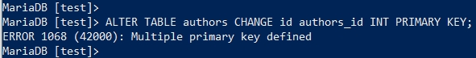

在解释这个问题之前，我们来看一个东西： ``SHOW INDEX FROM authors\G``

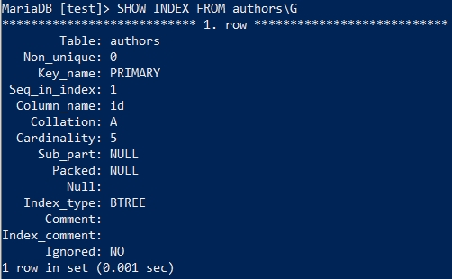

在快速入门中的 :ref:`operate_db` 创建的三个表中，都使用了 **PRIMARY KEY** 将id做为\
主键，这个过程就是为id这个字段创建了一种特殊索引（index）。索引是什么？可以理解为一本书的前\
几页介绍了某些内容在第几页，以便快速查找，关于索引的问题之后我们在详细探讨。但索引和所索引的字段是分开的，\
修改字段时，关联的索引不会自动修改或删除。而上面的例子在修改索引关联的字段时，系统会认为它在\
创建一个索引，但该字段已经有一个索引了，所以会报 **Multiple primary key defined** 的错误，\
所以正确的修改方式应该是这样的：

.. code-block:: sql

    ALTER TABLE authors 
    DROP PRIMARY KEY, 
    CHANGE id authors_id INT(11) PRIMARY KEY;

先把表中的PRIMARY KEY删除，然后在修改字段名时将PRIMARY KEY加回来，这样就达到了修改\
主键字段的目的。

还有一种情况是，数据表在创建之初没有添加索引，但后期想加上索引，而此时存在重复数据了，\
这时添加主键索引会报错：

.. code-block:: sql

    -- 删除主键
    ALTER TABLE authors DROP PRIMARY KEY;
    -- 插入重复数据
    INSERT INTO authors 
    (authors_id,name_last,name_first,country,address1) 
    VALUES 
    (6,'Si','Li','CN','Baotou');

此时添加索引会报错：

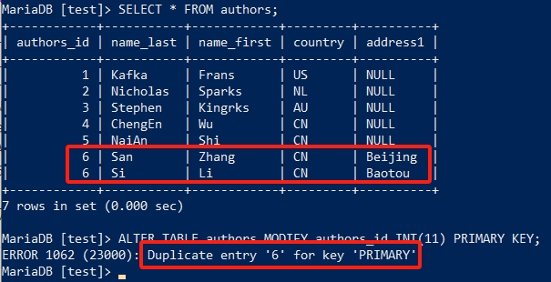

此时添加IGNORE标记，就可以忽略重复项，强行加上主键索引：

.. code-block:: sql

    ALTER IGNORE TABLE authors MODIFY authors_id INT(11) PRIMARY KEY;

但重复的数据会被删除，因此该方法在使用时要十分慎重，记得做好备份再去操作。

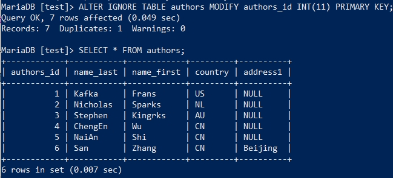

重命名表和表转移
----------------------------
前面的章节都是在对表中的字段进行操作修改，但有时候我们可能需要对表本身进行某些修改：

.. code-block:: sql

    RENAME TABLE authors 
    TO authors_info;

我们甚至可将表转移到另一个数据库中：

.. code-block:: sql

    -- 创建一个新的数据库
    CREATE DATABASE test1;
    -- 将authors_info转移到新的数据库中
    RENAME TABLE authors_info TO test1.authors_info;
    -- 查看新的数据库中有哪些表
    SHOW TABLES FROM test1;
    -- 查看当前数据库有哪些表
    SHOW TABLES;

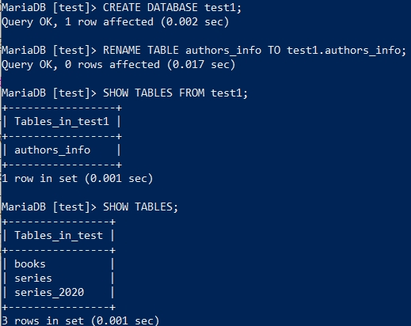

在学习完本章所有内容后，在快速入门中的 :ref:`operate_db` 里的CREATE TABLE语法也可\
尝试去理解了，本质上是与ALTER TABLE相通的。
