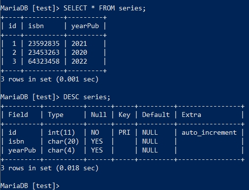
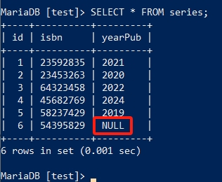

数据的插入与修改
===================
在 :doc:`/newcomer/beginner` 中我们已经进行过一些简单的数据插入与修改，它们也像上一节 :doc:`/newcomer/select` 的 **SELECT**
一样，有更多复杂的使用方式来应对真实应用场景中的各种需求，这一节就来探索一下在MariaDB中如何进行数据的添加与修改。

.. important:: 
    请确保你已学习过 :doc:`/newcomer/beginner` 和 :doc:`/newcomer/select` ，本节内容将使用在这两节教程中创建及修改的表结构及数据。

插入数据
-------------------
接着使用在 :doc:`/newcomer/beginner` 中创建的series表，在增加数据前可以使用 ``SELECT * FROM series;`` 以及 ``DESC series;`` 来看一下它现在的状态。

然后执行如下的SQL来添加数据，注意4要与上方图中的 **id** 顺序接上，45682769、2024则与 **isbn** 与 **yearPub** 对应：

.. code-block:: sql

    INSERT series
    VALUES
    ('4','45682769','2024');

再次执行 **SELECT** 查询语句查看刚刚查入的数据。

以上是 **INSERT** 非常基础的用法，它不需要指定字段名，直接把要插入的字段值带上即可写入到表中。
如果不想插入全部字段的值，只想插入某一个或几个的字段值，可以直接指定要写入的字段值：

.. code-block:: sql

    INSERT INTO 
    series
    (isbn,yearPub)
    VALUES
    ('58237429','2019');

.. hint:: 
    如 :ref:`insert_data` 中举的例子，series的id字段是 **auto_increment** 属性的，因此插入数据时没有提供id这个字段的值。

    同时在这条SQL中出现了 **INTO** 关键字，它是可选项，有无都不影响INSERT的执行。

只给一个字段插入数据：

.. code-block:: sql

    INSERT
    series
    (isbn)
    VALUES
    ('54395829');

而未在INSERT中指定的字段则默认为 **NULL** ：

而要想同时插入多条数据，可使用如下句式：

.. code-block:: sql

    INSERT IGNORE
    INTO 
    series
    VALUES 
    ('7','35256312','2016'),
    ('8','86391739','2021'),
    ('8','48932895','2022');

.. hint:: 
    注意到这条SQL的执行结果了吗？

    .. image:: ../img/4-3.png
        :align: center

    明明我们插入了3条数据，但是只有“2 rows affected”，通过SELECT查询发现只写入了两条数据。

虽然插入多条数据，但是第一个字段的8重复了，这个字段对应的是“id”，它是 **auto_increment** 属性的，虽然字段是自动增长的，但它不允许重复。
正常执行重复数据的插入是会报错的，但上面的SQL使用了 **IGNORE** 这个关键字，它会自动忽略重复的值，所以第一条和第二条数据插入了，但第三条数据并没有并插入。

如果我们再次插入重复的数据，而不加上 **IGNORE** 看看会发生什么：

.. code-block:: sql

    INSERT
    INTO 
    series
    VALUES 
    ('9','35223312','2011'),
    ('10','45891739','2002'),
    ('10','48932845','2024');

加上 **IGNORE** 上面的SQL也可以正常执行。

插入优先级
==============
像 :ref:`SELECT_priority` 一样，INSERT也可以调整执行的优先级。\
在一个繁忙的服务器上，INSERT语句是高于SELECT语句优先执行的，当INSERT语句执行时，\
会将写入的表锁住，此时SELECT语句需要等待INSERT语句执行结束后执行，这会引起用户不\
好的体验，如果不想让用户等待而插入的数据又可以晚一会儿插入，那可以降低INSERT语句\
的执行优先级:

.. code-block:: sql

    INSERT LOW_PRIORITY
    INTO series
    VALUES
    ('11','35228312','2001'),
    ('12','45391739','2002');