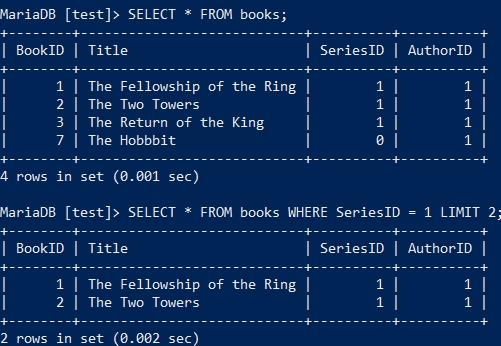
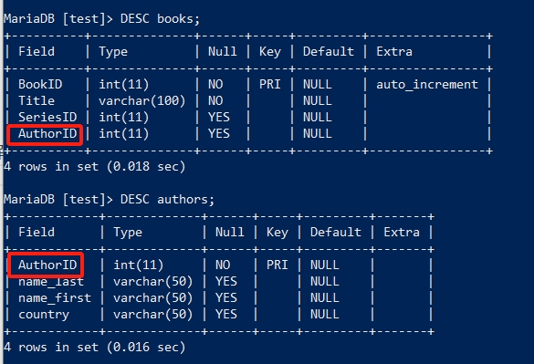
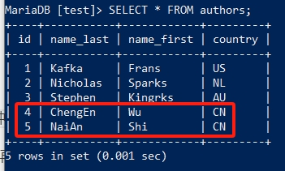

SELECT进阶
=====================

在此章节开始前，请确保你已学习过 :doc:`/newcomer/beginner` 中的内容。
在 :doc:`/newcomer/beginner` 中，我们使用了非常基础的 **SELECT** 语法去MariaDB中查询数据，
但随着数据表结构和数据量的变化，最基础的 **SELECT** 语法显然是无法满足需要的。因此从本节开始，我们将会探索 **SELECT** 语法中更高级的用法。

基础要素
-------------
上一章，我们使用 ``SELECT * FROM books;`` 查询books表中的数据， **\*** 表示选中所有字段进行查询，但是如果只想查询某一个或某几个字段呢？
此时只需要把 **\*** 号，替换为需要查询的字段名（column）即可，多字段需要用 **\,** 号隔开，请尝试运行以下的语句：

.. code-block:: sql

    SELECT Title, AuthorID
    FROM books;

.. image:: ../img/3-1.png
    :align: center

请观察上面的执行结果，与 ``SELECT * FROM books;`` 的执行结果有何区别？二者句式有何区别？

发现了吗？上面的 **SELECT** 只输出了我们指定的字段数据，其它字段并没有输出，而且一个完整的 **SELECT** 分成了两行。

.. hint:: 
    在SQL语法中，一个SQL语句可以分成很多行，一些较为复杂的查询条件，SELECT语句会特别长。此时
    为了方便观察，可以把它分割成很多行。无论怎么分割，它还是一个整体，最终要以 **\;** 号结尾，
    不然命令行还在等待输入，在你按下回车键之前，SQL语句并不会执行。

    .. image:: ../img/3-2.png
        :align: center

    SQL语法中还有两个特殊字符， **\\G** 和 **\\c**。

      * **\\G** 会将输出结果以行（row）为单位进行输出，请尝试执行 ``SELECT Title FROM books\G``，再执行 ``SELECT Title FROM books;``。
      * **\\c** 则会终止SQL语句的执行，以此为结尾的SQL语句在按下回车键后并不会执行，请尝试执行 ``SELECT Title FROM\c``。
    
试想一下，一个数据库使用了很长时间，里面已经存储了大量数据，一张表就就成千上万行的数据。但如果我只想看其中的一点点数据呢？此时可以使用 **LIMIT** 进行限制：

.. code-block:: sql

    SELECT * FROM books LIMIT 2

这里使用LIMIT限制SELECT的输出，虽然books表里有4条数据，但此时它的查询结果只会输出整张表的前两条数据。那如果我想知道第一行之后的两行数据，该怎么办？ 可以使用如下的 **LIMIT** 条件来达成。

.. code-block:: sql
    
    SELECT * FROM books LIMIT 1, 2;

1表示第一行，2表示第一行之后的两行数据，对比 ``SELECT * FROM books;`` 的结果，看看是不是这样的呢？

.. important:: 
    不知你是否注意到，截止到止前为止，教程中执行的所有SQL语句，所有的数据库命令相关单词都使用的大写，而表结构、表内数据等则没有特地使用大写？如 ``SELECT * FROM books LIMIT 5;``。

    这是因为在编写SQL时，大家习惯上都使用大写，虽然这不是一个强制要求，也不会影响数据库的SQL执行，但这已然成为了一个行业惯例。而在为数据库和表命名时，都使用小写。字段名（column）表结构则使用如 `驼峰命名法 <https://developer.mozilla.org/zh-CN/docs/Glossary/Camel_case>`_ 的方法等。

    这样就通过大写区分数据库命令，小写区分数据库名、表名，驼峰命名法等区分表结构字段名。

选择与排序
---------------
上一节的 **SELECT** 的查询，无法精确的查找某一条数据，比如 *SeriesID* 是某个具体值的？这一点在上一章 :ref:`select_where` 中涉及过，不过此时可以和 **LIMIT** 结合，更精细的在数据中查找数据：

.. code-block:: sql

    SELECT * FROM books WHERE SeriesID = 1 LIMIT 2;

**WHERE** 指定了查询条件，同时 **LIMIT** 限制了输出几条结果，如果想要对结果以字母数字的顺序进行排序呢？这时就需要使用 **ORDER BY** 从句了。

.. code-block:: sql

    SELECT * FROM books WHERE SeriesID = 1 ORDER BY Title ASC LIMIT 2;

此时， **SELECT** 语句到了一定量级了，有 **WHERE**、 **ORDER BY**、 **LIMIT** 三个条件，但它们的顺序不能乱，否则数据库会报语法（syntax）错误。

当 **SELECT** 语句执行时，MariaDB以 **WHERE** 为条件输出所有相关数据，然后以 **ORDER BY** 为条件对输出的数据进行排序，最后 **LIMIT** 为条件对结果进行限制输出，因此这三者的前后顺序不能乱，这也是这三个条件这样排序的原因。

.. hint:: 
    不知你是否注意到 **ASC** 这个flag，它在告诉数据库服务对输出结果进行正序排序，并且ASC是默认的，此处实际上无须带上 **ASC** 这个flag，不过如果我想倒序输出呢？你可以尝试将上面语句中的 **ASC** 改成 **DESC** ，再观察一下输出结果有什么不同。

上面的例子只是对其中一个字段进行了排序，那如果我想要对多个字段进行排序呢？这也是可以办到的，现在先运行下面的SQL为books这张表再添加几条数据，以便下面的实验结果更加明显。（目前无需理解 **INSERT** 语法，只专注于 **SELECT** 即可）。

.. code-block:: sql

    INSERT INTO books (BookID,Title,SeriesID,AuthorID) VALUES
    (4, 'The Trial', 2, 2),
    (5, 'The Metamorphosis', 2, 2),
    (6,'America',2,3),
    (8,'The Castle',2,3);

请使用 **SELECT** 观察一下最新的books表的最新数据，在新加的数据中，AuthorID相同，Title不同，我们就来通过这两个字段再进行排序，请运行以下SQL并观察它们的结果有何不同：

.. code-block:: sql

     SELECT * FROM books WHERE SeriesID = 2 ORDER BY AuthorID DESC, Title DESC;
     SELECT * FROM books WHERE SeriesID = 2 ORDER BY AuthorID DESC, Title ASC;

.. hint:: 
    **ORDER BY** 之后可以加多个字段名（column name），每个字段可以分别使用ASC或DESC的flag标记排序方法，然后以 **,** 隔开，就可以做到多字段进行排序，某些情况下这是非常有用的一种技巧。

多表查询
--------------
目前为止，我们所有的查询都只停留在一张表上，但数据库中不止一张表，而且多张表互相之前还会产生关联，这就意味着，如果想要获取一份完整的数据，需要从多张表中同时查询。
例如books中只有书名，作者在另一张authors的表中，books表中只能查到AuthorID，那如果想同时知道书名和作者名，需要同时查询books和authors并将它们关联起来才行。

先来为authors表中添加点数据，请先运行以下SQL（同样无须理解以下语法，只关注于 **SELECT** 即可）：

.. code-block:: sql

    ALTER TABLE authors 
    ADD 
    (name_last VARCHAR(50), 
    name_first VARCHAR(50), 
    country VARCHAR(50));

    alter table authors 
    change 
    id AuthorID int(11);

    INSERT INTO authors
    (name_last,name_first,country)
    VALUES
    ('Kafka','Frans','US'),
    ('Nicholas','Sparks','NL'),
    ('Stephen','Kingrks','AU'),
    ('ChengEn','Wu','CN'),
    ('NaiAn','Shi','CN');

多表查询需要使用 **JOIN** 从句关键字，比如我们现在要查询books中的书的作者是谁，可以运行以下SQL同时对books和authors进行关联查询：

.. code-block:: sql

    SELECT Title,
    CONCAT(name_first,' ',name_last) AS author 
    FROM books 
    JOIN authors USING (AuthorID) 
    WHERE name_first = 'Frans' 
    ORDER BY Title DESC 
    LIMIT 2;

此时，**SELECT** 语句又上升了一个量级，多表查询使得它看起来越发笨重，比起最初的 ``SELECT * FROM books;`` ，已然天差地别了。如果你已经跟着教程一步一步学习并理解，这个多表查询也就不足为虑。

多表查询实质上就是增加了 **JOIN** 这一语法从句，它是两个表关联的关键之处。要理解它俩是如何关联的，要先看它俩的表结构：

可以观察到两张表都有相同的 **AuthorID** 这个字段名，这就是它们的关联之处。而 **JOIN** 从句中的 *USING* 就是在表明这两个表要通过 **AuthorID** 关联起来。然而在实际生产环境中，有很多相关联的表格，关联字段名却不一样的情况，这时候关键字 **USING** 就无法适用了，需要改用以下句式：

.. note:: 
    先把authors的字段名AuthorID改回id，模拟真实的生产环境状况：

    .. code-block:: sql

        ALTER TABLE authors CHANGE AuthorID id int(11);

    此时，再使用 **USING** 将会报错，无法进行关联查询。

.. code-block:: sql

    SELECT Title,
    CONCAT(name_first,' ',name_last) AS author 
    FROM books 
    JOIN authors on AuthorID = id
    WHERE name_first = 'Frans' 
    ORDER BY Title DESC 
    LIMIT 2;

将 **JOIN** 处的关联条件重新更改后，在关联字段名不一致的情况，还是做到了关联查询的效果，更多 **JOIN** 的用法，请参见 `官方文档 <https://mariadb.com/kb/en/join-syntax/>`_。

此外，你也应该注意到上方SQL中的 **CONCAT** ，和查询结果中的 **author** ，但在authors表中的字段名却是 **name_first** 和 **name_last** 。 **CONCAT** 是数据库中的字符串函数（string function），它将两个字段 **name_first** 、 **name_last** 和空白字符 **\' \'** 连接在一起，让查询结果看起来更美观。

.. warning:: 
    在SQL中，字段名不需要用单引号 **\'** 引起来，但给予的查询参数要用 **\'** 引起来，不然SQL执行时会报错。如上方的 **name_first** 没有用单引号引起来，但是查询参数 **Frans** 却引起来了。

.. hint:: 
    你应该注意到，从本小节开始，一大段的SQL语句不再是一行，而是分割成了多行，这更有助于我们的书写和排查语法错误等好处。

此外，SQL中还支持匹配查询，比如 **Frans** 并不清楚全名或者查找以 **Fra** 开头的值，那可使用 **LIKE** 进行匹配查询：

.. code-block:: sql

    SELECT Title,
    CONCAT(name_first,' ',name_last) AS author 
    FROM books 
    JOIN authors on AuthorID = id
    WHERE name_first LIKE 'Fra%' 
    ORDER BY Title DESC 
    LIMIT 2;

以上是两张表联合查询，那要是三张表，或是更多表怎么办？先运行以下sql，为第三张表series填充数据：

.. code-block:: sql

    ALTER TABLE 
    series 
    ADD 
    (isbn CHAR(20), yearPub CHAR(4));

    INSERT INTO 
    series (isbn,yearPub) 
    VALUES 
    (23592835,2021),(23453263,2020),(64323458,2022);

    UPDATE books 
    SET SeriesID=3 
    WHERE BookID=7;

在填充完第三表的数据后，开始联合三张表进行查询：

.. code-block:: 

    SELECT Title,isbn,
    CONCAT(name_first,' ',name_last) AS author 
    FROM books 
    JOIN (authors,series) 
    ON 
    (books.SeriesID=series.id AND books.AuthorID=authors.id) 
    WHERE name_first LIKE 'Fran%' 
    ORDER BY Title DESC 
    LIMIT 2;

观察 **JOIN** 相对于上面两张表联合查询时的写法，多张表联合查询时要将多个表放到括号内以 **\,** 号隔开，
并在 **ON** 处用括号将这些表与 **FROM** 处的表描述好关联关系，用 **AND** 相连即可。

当然也可以将关联条件逐个写出也可：

.. code-block:: sql

    SELECT Title,isbn,
    CONCAT(name_first,' ',name_last) AS author
    FROM books
    JOIN authors ON books.AuthorID=authors.id
    JOIN series ON books.SeriesID=series.id
    WHERE name_first LIKE 'Fran%'
    ORDER BY Title DESC
    LIMIT 2;

JOIN的四种结合方式
-----------------------
不知你是否注意到，虽然这三个表都以某种方式关联后进行查询得出结果，但有些数据并没有匹配到，可是也没有输出到结果中？

**JOIN** 有四种方式：

    * INNER JOIN
    * CROSS JOIN（MariaDB默认的方式）
    * LEFT JOIN
    * RIGHT JOIN
  
在JOIN从句前没有加任何东西时，JOIN的执行方式就是 **CROSS JOIN**，这是系统默认的，
此种结合方式下，每一张表的每一行数据都会与其它表的每一行数据结合，这种方式也称之为 `卡迪尔乘积 <https://baike.baidu.com/item/%E7%AC%9B%E5%8D%A1%E5%B0%94%E4%B9%98%E7%A7%AF/6323173>`_ 。
比如执行以下SQL，查看输出结果，是不是两张表每一行都相互结合了？

.. code-block:: sql

    SELECT * FROM books CORSS JOIN authors;

**INNER JOIN** 是两张表在指定结合条件下，只有匹配到的行才输出出来，如执行以下SQL：

.. code-block:: sql

    SELECT * FROM books INNER JOIN authors ON books.AuthorID = authors.id;

**LEFT JOIN** 与 **RIGHT JOIN** 的作用是相反的，理解一个就能理解另一个的作用。 **LEFT JOIN** 是指以JOIN为界，JOIN左边的表中的内容
与JOIN右边的表中内容进行匹配，如果没有匹配到，而会输出 **NULL**。如以下SQL：

.. code-block:: sql

    SELECT * FROM authors LEFT JOIN books ON books.AuthorID = authors.id;

**RIGHT JOIN** 的作用则与 **RIGHT JOIN** 相反。

多多练习 **SELECT** 的多表联合查询，即便再长的 **SELECT** 查询语句也不足为虑。

其它有用的flag
-------------------------

数据去重
^^^^^^^^^^^^
在某些情况下，我们会查出一些重复的数据，比如：

.. code-block:: sql

    SELECT SeriesID,
    CONCAT(name_first,' ',name_last) AS author 
    FROM books 
    JOIN authors on AuthorID = id
    WHERE name_first LIKE 'Fra%' 
    ORDER BY Title DESC;

如果不想看到这些重复的数据，那就可以使用 **DISTINCT** 去重，对比以下SQL的查询结果：

.. code-block:: sql

    SELECT DISTINCT SeriesID,
    CONCAT(name_first,' ',name_last) AS author 
    FROM books 
    JOIN authors on AuthorID = id
    WHERE name_first LIKE 'Fra%' 
    ORDER BY Title DESC;

SELECT优先执行
^^^^^^^^^^^^^^^^^^^^^
在一台繁忙的数据库服务中，SELECT查询操作可能在与修改、更新等操作同步进行，此时，修改和更新会优先于SELECT执行，那如果想要提高SELECT的执行级，可以使用 **HIGH_PRIORITY** 来要求服务器优先响应SELECT的查询：

.. code-block:: sql

    SELECT DISTINCT HIGH_PRIORITY SeriesID,
    CONCAT(name_first,' ',name_last) AS author 
    FROM books 
    JOIN authors on AuthorID = id
    WHERE name_first LIKE 'Fra%' 
    ORDER BY Title DESC;

计算SELECT查询到的行（rows）数
^^^^^^^^^^^^^^^^^^^^^^^^^^^^^^^^^^^

在SELECT执行完毕后，系统会临时记录查到到的行数，如：

.. code-block:: sql

    SELECT SeriesID,
    CONCAT(name_first,' ',name_last) AS author 
    FROM books 
    JOIN authors on AuthorID = id
    WHERE name_first LIKE 'Fra%' 
    ORDER BY Title DESC
    LIMIT 2;
    SELECT FOUND_ROWS();

.. image:: ../img/3-5.png
    :align: center

而 **SQL_CALC_FOUND_ROWS** 则会忽略 **LIMIT** 强制计算找到的行数，如：

.. code-block:: sql

    SELECT SQL_CALC_FOUND_ROWS SeriesID,
    CONCAT(name_first,' ',name_last) AS author 
    FROM books 
    JOIN authors on AuthorID = id
    WHERE name_first LIKE 'Fra%' 
    ORDER BY Title DESC
    LIMIT 2;
    SELECT FOUND_ROWS();

FOUND_ROWS()记录的值是临时的，只对现在登录的数据库窗口有效，在退出后就消失；多窗口登录的情况下，另一个窗口并不可见，每个窗口即一个连接会话（session）。